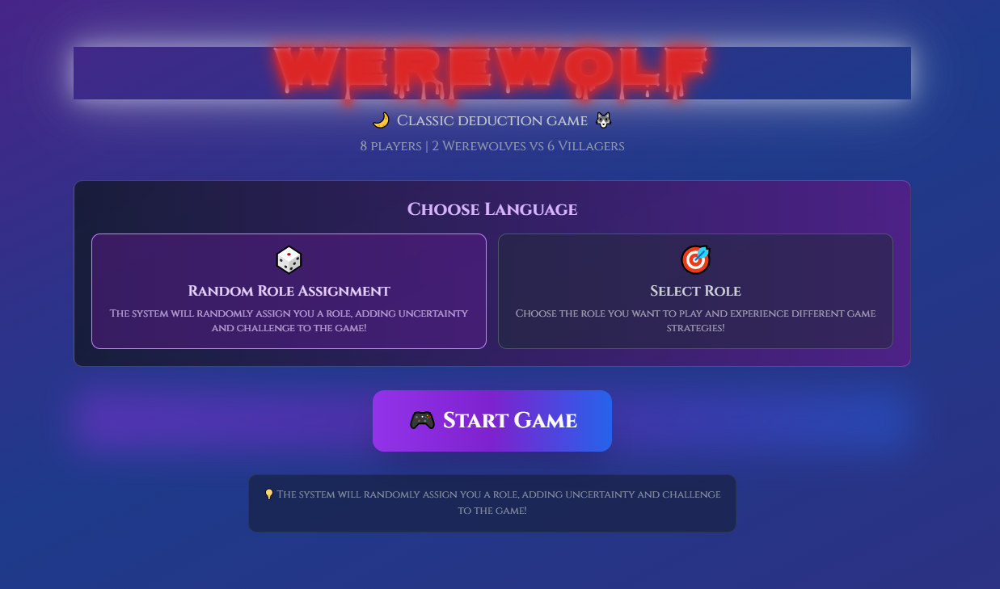
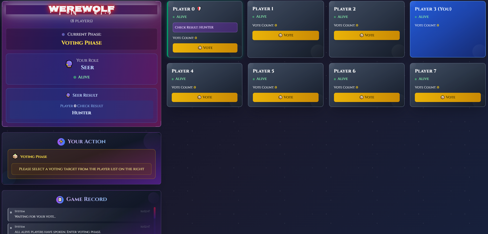
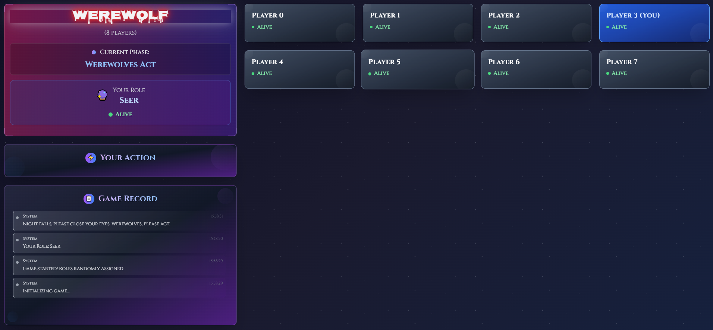
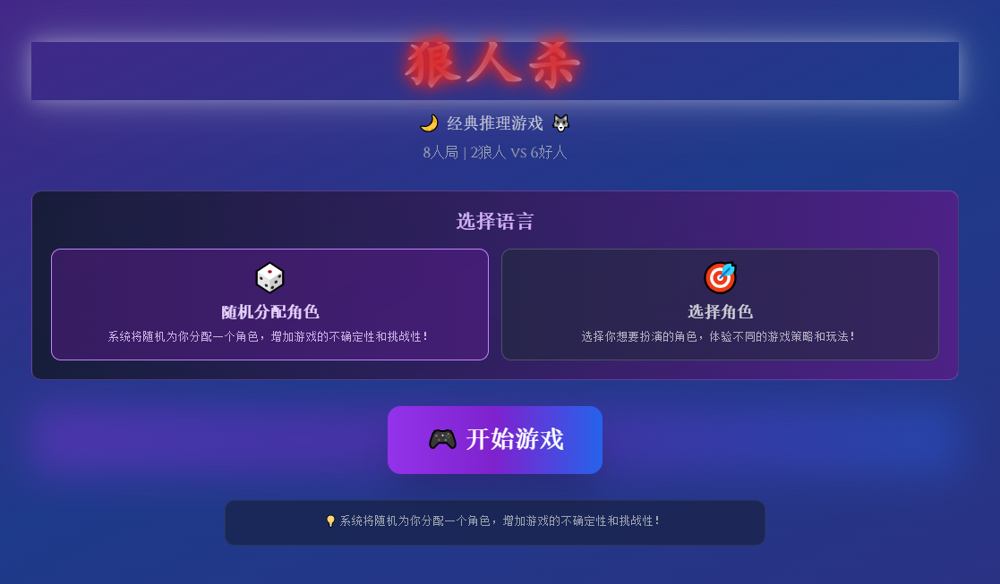
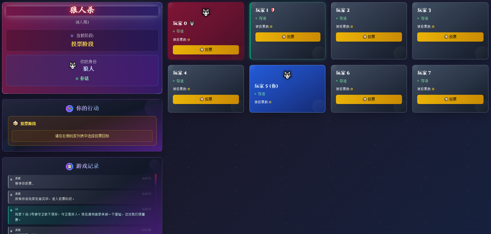
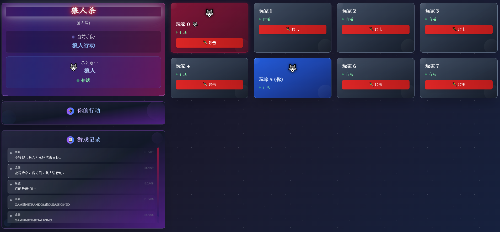

# Werewolf Game

A modern web-based implementation of the classic Werewolf party game, featuring both human and AI players.

## Overview

This is an interactive Werewolf game that allows human players to play against AI-controlled players. The game features a beautiful user interface built with React and includes various game phases, player roles, and interactive voting mechanics.

## Screenshots


*Main game interface showing the player cards and game log*


*Voting phase with player interactions*


*Night phase with role actions*

## Features

- 🎮 Real-time game mechanics
- 🤖 AI-controlled players with intelligent decision making
- 👥 Support for multiple human players
- 🎭 Various player roles (Werewolf, Villager, etc.)
- 📊 Interactive voting system
- 📝 Detailed game logs
- 🎨 Modern and responsive UI design
- 🌙 Dark mode interface

## Game Phases

The game follows a structured sequence of phases:
1. Night Phase - Werewolves and special roles perform their actions
2. Day Phase - Players discuss and debate
3. Voting Phase - Players vote to eliminate a suspected werewolf
4. Vote Results - The results are revealed and eliminated players are removed

## Getting Started

### Prerequisites

- Node.js (v14 or higher)
- npm or yarn
- **Choose one AI provider:**
  - Google Gemini API key (for cloud-based AI) OR
  - OpenAI compatible API (OpenAI, OpenRouter, etc.) OR
  - Ollama installation (for local AI)

### AI Configuration

This game supports three AI providers: **Gemini** (Google AI), **OpenAI Compatible APIs**, and **Ollama** (Local AI). Choose the one that best fits your needs.

#### Environment Variables Setup

Create a `.env` file in the root directory with the following configuration:

```env
# AI Provider Configuration
# Choose your AI provider: 'gemini', 'openai', or 'ollama'
REACT_APP_AI_PROVIDER=gemini

# Gemini Configuration (Google AI)
# Get your API key from: https://makersuite.google.com/app/apikey
REACT_APP_GEMINI_API_KEY=your_gemini_api_key_here
REACT_APP_GEMINI_MODEL=gemini-2.5-flash

# OpenAI Compatible Configuration (OpenAI, OpenRouter, etc.)
# For OpenAI: Get your API key from https://platform.openai.com/api-keys
# For OpenRouter: Get your API key from https://openrouter.ai/keys
REACT_APP_OPENAI_API_KEY=your_openai_api_key_here
REACT_APP_OPENAI_MODEL=gpt-4o-mini
REACT_APP_OPENAI_BASE_URL=https://api.openai.com/v1

# Ollama Configuration (Local AI)
# Make sure Ollama is running locally or on your server
REACT_APP_OLLAMA_BASE_URL=http://localhost:11434
REACT_APP_OLLAMA_MODEL=gemma3:4b
```

#### Option 1: Using Gemini (Google AI)

1. **Get a Gemini API Key:**
   - Visit [Google AI Studio](https://makersuite.google.com/app/apikey)
   - Sign in with your Google account
   - Create a new API key
   - Copy the generated API key

2. **Configure Environment Variables:**
   - Set `REACT_APP_AI_PROVIDER=gemini`
   - Add your API key to `REACT_APP_GEMINI_API_KEY`
   - Choose your model (optional, defaults to gemini-2.5-flash)

**Recommended Gemini Models:**
- `gemini-2.5-flash` - Latest stable model (default)
- `gemini-1.5-flash` - Fast and reliable
- `gemini-1.5-pro` - More capable but slower

#### Option 2: Using OpenAI Compatible APIs

This option supports multiple providers that use OpenAI-compatible endpoints, including OpenAI, OpenRouter, Together AI, and many others.

1. **Get an API Key:**
   - **OpenAI**: Visit [OpenAI Platform](https://platform.openai.com/api-keys)
   - **OpenRouter**: Visit [OpenRouter Keys](https://openrouter.ai/keys) - Access to 200+ models
   - **Together AI**: Visit [Together AI](https://api.together.xyz/) - Fast inference
   - **阿里云百炼**: Visit [阿里云百炼](https://bailian.console.aliyun.com/#/home) - Multiple model selection
   - **Other providers**: Check their documentation for API keys

2. **Configure Environment Variables:**
   - Set `REACT_APP_AI_PROVIDER=openai`
   - Add your API key to `REACT_APP_OPENAI_API_KEY`
   - Set the base URL for your provider (optional for OpenAI)
   - Choose your model

**Provider Examples:**

**OpenAI (Default):**
```env
REACT_APP_AI_PROVIDER=openai
REACT_APP_OPENAI_API_KEY=sk-your-openai-key
REACT_APP_OPENAI_MODEL=gpt-4o-mini
REACT_APP_OPENAI_BASE_URL=https://api.openai.com/v1
```

**OpenRouter (200+ models):**
```env
REACT_APP_AI_PROVIDER=openai
REACT_APP_OPENAI_API_KEY=sk-or-v1-your-openrouter-key
REACT_APP_OPENAI_MODEL=anthropic/claude-3-haiku
REACT_APP_OPENAI_BASE_URL=https://openrouter.ai/api/v1
```

**Together AI:**
```env
REACT_APP_AI_PROVIDER=openai
REACT_APP_OPENAI_API_KEY=your-together-key
REACT_APP_OPENAI_MODEL=meta-llama/Llama-3.2-3B-Instruct-Turbo
REACT_APP_OPENAI_BASE_URL=https://api.together.xyz/v1
```

**Recommended Models by Provider:**

**OpenAI:**
- `gpt-4o-mini` - Fast and cost-effective (default)
- `gpt-4o` - Most capable OpenAI model
- `gpt-3.5-turbo` - Budget-friendly option

**OpenRouter (popular choices):**
- `anthropic/claude-3-haiku` - Fast and intelligent
- `meta-llama/llama-3.1-8b-instruct` - Open source, good quality
- `google/gemini-flash-1.5` - Google's fast model
- `openai/gpt-4o-mini` - OpenAI via OpenRouter

**Together AI:**
- `meta-llama/Llama-3.2-3B-Instruct-Turbo` - Fast inference
- `meta-llama/Llama-3.1-8B-Instruct-Turbo` - Better quality
- `mistralai/Mixtral-8x7B-Instruct-v0.1` - Mixture of experts

#### Option 3: Using Ollama (Local AI)

1. **Install Ollama:**
   - Download from [ollama.ai](https://ollama.ai/)
   - Install and start the service

2. **Pull AI Model:**
   ```bash
   # Install the default model
   ollama pull gemma3:4b
   
   # Or try other models
   ollama pull gemma2:9b
   ollama pull llama3.2:3b
   ollama pull qwen2.5:7b
   ```

3. **Configure Environment Variables:**
   - Set `REACT_APP_AI_PROVIDER=ollama`
   - Set the base URL (defaults to http://localhost:11434)
   - Choose your model (defaults to gemma3:4b)

**Recommended Ollama Models:**
- `gemma3:4b` - Good balance of speed and quality (default)
- `gemma2:9b` - Better quality, requires more memory
- `llama3.2:3b` - Meta's Llama model
- `qwen2.5:7b` - Alibaba's Qwen model

#### Switching Between Providers

Simply change the `REACT_APP_AI_PROVIDER` value:
- `gemini` - Use Google's Gemini API (requires API key)
- `openai` - Use OpenAI compatible APIs (requires API key)
- `ollama` - Use local Ollama installation (requires local setup)

#### Troubleshooting

**Gemini Issues:**
- **Geographic restrictions**: Some regions don't support Gemini. Consider using OpenAI or Ollama instead.
- **API key errors**: Double-check your API key is correct
- **Rate limits**: Wait a moment before trying again

**OpenAI Compatible API Issues:**
- **API key errors**: Verify your API key is correct and has proper permissions
- **Model not available**: Check if the model exists on your chosen provider
- **Rate limits**: Wait before trying again, or upgrade your plan
- **Quota exceeded**: Check your billing/credits on the provider's dashboard
- **Wrong base URL**: Ensure the base URL matches your provider's endpoint

**Ollama Issues:**
- **Connection errors**: Make sure Ollama is running (`ollama serve`)
- **Model not found**: Pull the model first (`ollama pull model-name`)
- **Server errors**: Check Ollama logs for issues

#### Performance Comparison

| Provider | Speed | Quality | Privacy | Cost | Access |
|----------|-------|---------|---------|------|--------|
| Gemini   | Fast  | High    | Cloud   | Pay per use | Limited regions |
| OpenAI   | Fast  | Very High | Cloud | Pay per use | Global |
| Ollama   | Variable | Variable | Local | Free | Local only |

**Choose based on your needs:**
- **Gemini**: Good balance of speed and quality, but has geographic restrictions
- **OpenAI**: Highest quality responses, works globally, most expensive
- **Ollama**: Best for privacy and offline use, performance depends on your hardware, completely free

### Installation

1. Clone the repository:
```bash
git clone https://github.com/yourusername/Werewolf.git
cd Werewolf
```

2. Install dependencies:
```bash
npm install
# or
yarn install
```

3. Configure your environment variables (see API Configuration section above)

4. Start the development server:
```bash
npm start
# or
yarn start
```

5. Open your browser and navigate to `http://localhost:3000`

## How to Play

1. Start a new game by selecting the number of players
2. Each player will be assigned a role (Werewolf or Villager)
3. Follow the game phases:
   - During the night, werewolves can eliminate one player
   - During the day, discuss and try to identify the werewolves
   - Vote to eliminate a suspected werewolf
4. The game continues until either all werewolves are eliminated (Villagers win) or the number of werewolves equals the number of villagers (Werewolves win)

## Technologies Used

- React
- Tailwind CSS
- JavaScript/JSX
- Modern ES6+ features

## Contributing

Contributions are welcome! Please feel free to submit a Pull Request.

## License

This project is licensed under the MIT License - see the LICENSE file for details.

## Acknowledgments

- Inspired by the classic Werewolf party game
- Built with modern web technologies
- Special thanks to all contributors

---

# 狼人杀游戏

一个现代化的网页版狼人杀游戏实现，支持人类玩家与AI玩家对战。

## 项目概述

这是一个互动性强的狼人杀游戏，允许人类玩家与AI控制的玩家进行对战。游戏采用React构建，具有美观的用户界面，包含多个游戏阶段、玩家角色和互动投票机制。

## 游戏截图


*主游戏界面，显示玩家卡片和游戏日志*


*投票阶段的玩家互动*


*夜晚阶段的角色行动*

## 主要特点

- 🎮 实时游戏机制
- 🤖 具有智能决策能力的AI玩家
- 👥 支持多个人类玩家
- 🎭 多种玩家角色（狼人、村民等）
- 📊 互动投票系统
- 📝 详细的游戏日志
- 🎨 现代化响应式界面设计
- 🌙 深色模式界面

## 游戏阶段

游戏按照以下结构化的阶段进行：
1. 夜晚阶段 - 狼人和特殊角色执行行动
2. 白天阶段 - 玩家讨论和辩论
3. 投票阶段 - 玩家投票淘汰可疑的狼人
4. 投票结果 - 公布结果并移除被淘汰的玩家

## 开始使用

### 环境要求

- Node.js (v14或更高版本)
- npm 或 yarn
- **选择一种AI提供商：**
  - Google Gemini API密钥（用于云端AI）或
  - Ollama安装（用于本地AI）

### AI配置

本游戏支持三种AI提供商：**Gemini**（Google AI）、**OpenAI兼容API**和**Ollama**（本地AI）。请选择最适合您需求的方案。

#### 环境变量设置

在根目录创建`.env`文件，包含以下配置：

```env
# AI提供商配置
# 选择您的AI提供商：'gemini'、'openai' 或 'ollama'
REACT_APP_AI_PROVIDER=gemini

# Gemini配置（Google AI）
# 从这里获取API密钥：https://makersuite.google.com/app/apikey
REACT_APP_GEMINI_API_KEY=your_gemini_api_key_here
REACT_APP_GEMINI_MODEL=gemini-2.5-flash

# OpenAI兼容配置（OpenAI、OpenRouter等）
# OpenAI：从 https://platform.openai.com/api-keys 获取API密钥
# OpenRouter：从 https://openrouter.ai/keys 获取API密钥
REACT_APP_OPENAI_API_KEY=your_openai_api_key_here
REACT_APP_OPENAI_MODEL=gpt-4o-mini
REACT_APP_OPENAI_BASE_URL=https://api.openai.com/v1

# Ollama配置（本地AI）
# 确保Ollama在本地或服务器上运行
REACT_APP_OLLAMA_BASE_URL=http://localhost:11434
REACT_APP_OLLAMA_MODEL=gemma3:4b
```

#### 方案一：使用Gemini（Google AI）

1. **获取Gemini API密钥：**
   - 访问 [Google AI Studio](https://makersuite.google.com/app/apikey)
   - 使用Google账户登录
   - 创建新的API密钥
   - 复制生成的API密钥

2. **配置环境变量：**
   - 设置 `REACT_APP_AI_PROVIDER=gemini`
   - 将API密钥添加到 `REACT_APP_GEMINI_API_KEY`
   - 选择模型（可选，默认为gemini-2.5-flash）

**推荐的Gemini模型：**
- `gemini-2.5-flash` - 最新稳定模型（默认）
- `gemini-1.5-flash` - 快速可靠
- `gemini-1.5-pro` - 更强大但较慢

#### 方案二：使用OpenAI兼容API

此选项支持多个使用OpenAI兼容端点的提供商，包括OpenAI、OpenRouter、Together AI等。

1. **获取API密钥：**
   - **OpenAI**: 访问 [OpenAI平台](https://platform.openai.com/api-keys)
   - **OpenRouter**: 访问 [OpenRouter密钥](https://openrouter.ai/keys) - 访问200+模型
   - **Together AI**: 访问 [Together AI](https://api.together.xyz/) - 快速推理
   - **阿里云百炼**: 访问 [阿里云百炼](https://bailian.console.aliyun.com/#/home) - 访问Qwen和DeepSeek相关的模型
   - **其他提供商**: 查看其文档获取API密钥

2. **配置环境变量：**
   - 设置 `REACT_APP_AI_PROVIDER=openai`
   - 将API密钥添加到 `REACT_APP_OPENAI_API_KEY`
   - 为您的提供商设置基础URL（OpenAI可选）
   - 选择您的模型

**提供商示例：**

**OpenAI（默认）：**
```env
REACT_APP_AI_PROVIDER=openai
REACT_APP_OPENAI_API_KEY=sk-your-openai-key
REACT_APP_OPENAI_MODEL=gpt-4o-mini
REACT_APP_OPENAI_BASE_URL=https://api.openai.com/v1
```

**OpenRouter（200+模型）：**
```env
REACT_APP_AI_PROVIDER=openai
REACT_APP_OPENAI_API_KEY=sk-or-v1-your-openrouter-key
REACT_APP_OPENAI_MODEL=anthropic/claude-3-haiku
REACT_APP_OPENAI_BASE_URL=https://openrouter.ai/api/v1
```

**推荐模型：**

**OpenAI：**
- `gpt-4o-mini` - 快速且经济实惠（默认）
- `gpt-4o` - 最强大的OpenAI模型
- `gpt-3.5-turbo` - 预算友好选项

**OpenRouter（热门选择）：**
- `anthropic/claude-3-haiku` - 快速且智能
- `meta-llama/llama-3.1-8b-instruct` - 开源，质量好
- `google/gemini-flash-1.5` - Google的快速模型

#### 方案三：使用Ollama（本地AI）

1. **安装Ollama：**
   - 从 [ollama.ai](https://ollama.ai/) 下载
   - 安装并启动服务

2. **拉取AI模型：**
   ```bash
   # 安装默认模型
   ollama pull gemma3:4b
   
   # 或尝试其他模型
   ollama pull gemma2:9b
   ollama pull llama3.2:3b
   ollama pull qwen2.5:7b
   ```

3. **配置环境变量：**
   - 设置 `REACT_APP_AI_PROVIDER=ollama`
   - 设置基础URL（默认为http://localhost:11434）
   - 选择模型（默认为gemma3:4b）

**推荐的Ollama模型：**
- `gemma3:4b` - 速度和质量的良好平衡（默认）
- `gemma2:9b` - 更好质量，需要更多内存
- `llama3.2:3b` - Meta的Llama模型
- `qwen2.5:7b` - 阿里巴巴的Qwen模型

#### 切换提供商

只需更改 `REACT_APP_AI_PROVIDER` 的值：
- `gemini` - 使用Google的Gemini API（需要API密钥）
- `openai` - 使用OpenAI兼容API（需要API密钥）
- `ollama` - 使用本地Ollama安装（需要本地设置）

#### 故障排除

**Gemini问题：**
- **地理限制**：某些地区不支持Gemini。考虑使用OpenAI或Ollama替代。
- **API密钥错误**：请检查API密钥是否正确
- **速率限制**：请稍等片刻后重试

**OpenAI兼容API问题：**
- **API密钥错误**：验证API密钥是否正确且具有适当权限
- **模型不可用**：检查您选择的提供商是否存在该模型
- **速率限制**：请等待后重试，或升级您的计划
- **配额超限**：检查提供商仪表板上的账单/积分
- **错误的基础URL**：确保基础URL与您的提供商端点匹配

**Ollama问题：**
- **连接错误**：确保Ollama正在运行（`ollama serve`）
- **模型未找到**：请先拉取模型（`ollama pull model-name`）
- **服务器错误**：检查Ollama日志

#### 性能对比

| 提供商 | 速度 | 质量 | 隐私 | 成本 | 访问性 |
|--------|------|------|------|------|--------|
| Gemini | 快速 | 高 | 云端 | 按使用付费 | 地域限制 |
| OpenAI | 快速 | 很高 | 云端 | 按使用付费 | 全球 |
| Ollama | 可变 | 可变 | 本地 | 免费 | 仅本地 |

**根据需求选择：**
- **Gemini**：速度和质量的良好平衡，但有地理限制
- **OpenAI**：最高质量响应，全球可用，成本最高
- **Ollama**：最佳隐私和离线使用，性能取决于硬件配置，完全免费

### 安装步骤

1. 克隆仓库：
```bash
git clone https://github.com/yourusername/Werewolf.git
cd Werewolf
```

2. 安装依赖：
```bash
npm install
# 或
yarn install
```

3. 配置环境变量（参见上面的API配置部分）

4. 启动开发服务器：
```bash
npm start
# 或
yarn start
```

5. 在浏览器中访问 `http://localhost:3000`

## 游戏玩法

1. 通过选择玩家数量开始新游戏
2. 每个玩家将被分配一个角色（狼人或村民）
3. 按照游戏阶段进行：
   - 夜晚时，狼人可以淘汰一名玩家
   - 白天时，讨论并尝试识别狼人
   - 投票淘汰可疑的狼人
4. 游戏持续进行，直到所有狼人被淘汰（村民获胜）或狼人数量等于村民数量（狼人获胜）

## 使用的技术

- React
- Tailwind CSS
- JavaScript/JSX
- 现代ES6+特性

## 参与贡献

欢迎贡献代码！请随时提交Pull Request。

## 许可证

本项目采用MIT许可证 - 详情请查看LICENSE文件。

## 致谢

- 灵感来源于经典狼人杀派对游戏
- 使用现代网页技术构建
- 特别感谢所有贡献者 