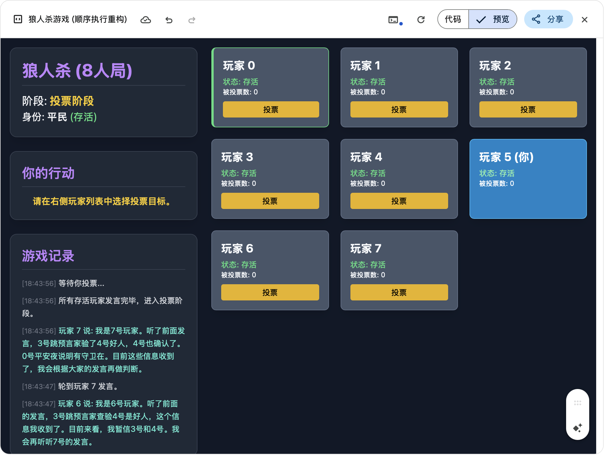
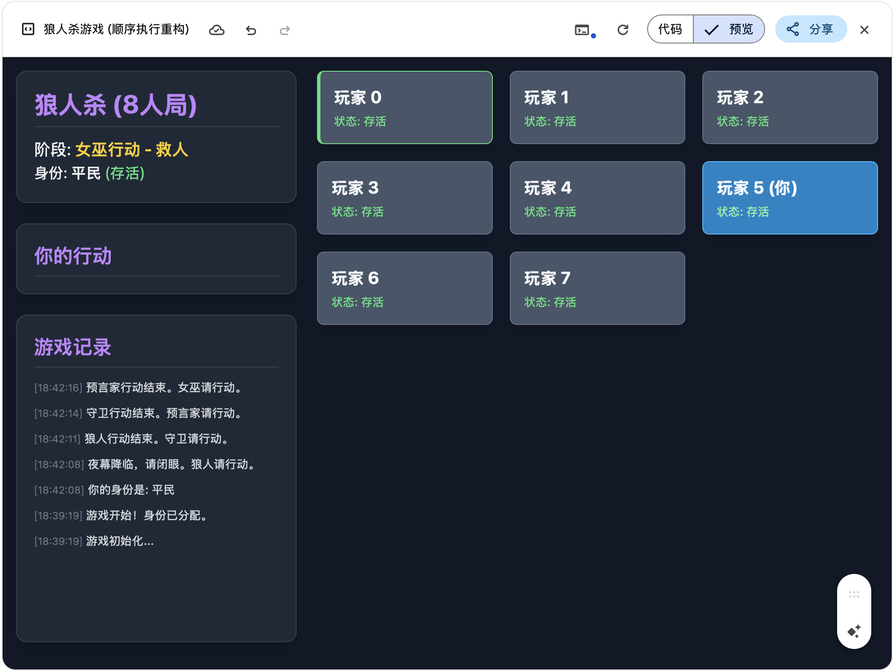

# Werewolf Game

A modern web-based implementation of the classic Werewolf party game, featuring both human and AI players.

## Overview

This is an interactive Werewolf game that allows human players to play against AI-controlled players. The game features a beautiful user interface built with React and includes various game phases, player roles, and interactive voting mechanics.

## Screenshots


*Main game interface showing the player cards and game log*


*Voting phase with player interactions*


*Night phase with role actions*

## Features

- 🎮 Real-time game mechanics
- 🤖 AI-controlled players with intelligent decision making
- 👥 Support for multiple human players
- 🎭 Various player roles (Werewolf, Villager, etc.)
- 📊 Interactive voting system
- 📝 Detailed game logs
- 🎨 Modern and responsive UI design
- 🌙 Dark mode interface

## Game Phases

The game follows a structured sequence of phases:
1. Night Phase - Werewolves and special roles perform their actions
2. Day Phase - Players discuss and debate
3. Voting Phase - Players vote to eliminate a suspected werewolf
4. Vote Results - The results are revealed and eliminated players are removed

## Getting Started

### Prerequisites

- Node.js (v14 or higher)
- npm or yarn

### Installation

1. Clone the repository:
```bash
git clone https://github.com/yourusername/Werewolf.git
cd Werewolf
```

2. Install dependencies:
```bash
npm install
# or
yarn install
```

3. Start the development server:
```bash
npm start
# or
yarn start
```

4. Open your browser and navigate to `http://localhost:3000`

## How to Play

1. Start a new game by selecting the number of players
2. Each player will be assigned a role (Werewolf or Villager)
3. Follow the game phases:
   - During the night, werewolves can eliminate one player
   - During the day, discuss and try to identify the werewolves
   - Vote to eliminate a suspected werewolf
4. The game continues until either all werewolves are eliminated (Villagers win) or the number of werewolves equals the number of villagers (Werewolves win)

## Technologies Used

- React
- Tailwind CSS
- JavaScript/JSX
- Modern ES6+ features

## Contributing

Contributions are welcome! Please feel free to submit a Pull Request.

## License

This project is licensed under the MIT License - see the LICENSE file for details.

## Acknowledgments

- Inspired by the classic Werewolf party game
- Built with modern web technologies
- Special thanks to all contributors

---

# 狼人杀游戏

一个现代化的网页版狼人杀游戏实现，支持人类玩家与AI玩家对战。

## 项目概述

这是一个互动性强的狼人杀游戏，允许人类玩家与AI控制的玩家进行对战。游戏采用React构建，具有美观的用户界面，包含多个游戏阶段、玩家角色和互动投票机制。

## 游戏截图


*主游戏界面，显示玩家卡片和游戏日志*


*投票阶段的玩家互动*


*夜晚阶段的角色行动*

## 主要特点

- 🎮 实时游戏机制
- 🤖 具有智能决策能力的AI玩家
- 👥 支持多个人类玩家
- 🎭 多种玩家角色（狼人、村民等）
- 📊 互动投票系统
- 📝 详细的游戏日志
- 🎨 现代化响应式界面设计
- 🌙 深色模式界面

## 游戏阶段

游戏按照以下结构化的阶段进行：
1. 夜晚阶段 - 狼人和特殊角色执行行动
2. 白天阶段 - 玩家讨论和辩论
3. 投票阶段 - 玩家投票淘汰可疑的狼人
4. 投票结果 - 公布结果并移除被淘汰的玩家

## 开始使用

### 环境要求

- Node.js (v14或更高版本)
- npm 或 yarn

### 安装步骤

1. 克隆仓库：
```bash
git clone https://github.com/yourusername/Werewolf.git
cd Werewolf
```

2. 安装依赖：
```bash
npm install
# 或
yarn install
```

3. 启动开发服务器：
```bash
npm start
# 或
yarn start
```

4. 在浏览器中访问 `http://localhost:3000`

## 游戏玩法

1. 通过选择玩家数量开始新游戏
2. 每个玩家将被分配一个角色（狼人或村民）
3. 按照游戏阶段进行：
   - 夜晚时，狼人可以淘汰一名玩家
   - 白天时，讨论并尝试识别狼人
   - 投票淘汰可疑的狼人
4. 游戏持续进行，直到所有狼人被淘汰（村民获胜）或狼人数量等于村民数量（狼人获胜）

## 使用的技术

- React
- Tailwind CSS
- JavaScript/JSX
- 现代ES6+特性

## 参与贡献

欢迎贡献代码！请随时提交Pull Request。

## 许可证

本项目采用MIT许可证 - 详情请查看LICENSE文件。

## 致谢

- 灵感来源于经典狼人杀派对游戏
- 使用现代网页技术构建
- 特别感谢所有贡献者 